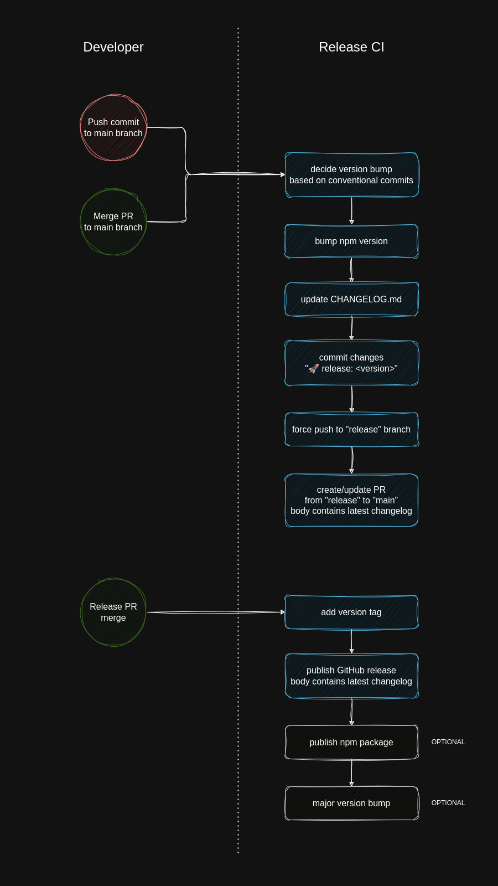

<p align="center">
  <a href="https://localazy.com">
    
  </a>
</p>

# 📦 localazy/release@v1

Localazy GitHub action for automating the release process.

## 🔧 Installation

Due to the limitations of GitHub's default action authorization, you cannot trigger another action with events
dispatched by the original action. For example, if a GitHub action creates a pull request it will not run any checks for
that PR. This is intentional to prevent infinite actions loop, although it can be bypassed by using different
authorization token, therefore you need to create GitHub app for sole purpose of CI authorization and pass **app id**
and **app private key** to the `localazy/release` action.

https://github.com/peter-evans/create-pull-request/blob/main/docs/concepts-guidelines.md#authenticating-with-github-app-generated-tokens

## 🚀 Usage

### Example

```yml
name: Release CI

on:
  push:
    branches:
      - main

permissions:
  contents: write
  pull-requests: write

jobs:
  prepare:
    name: Prepare Release
    if: github.event.head.ref != 'release' && !contains(github.event.commits[0].message, '🚀 release:')
    runs-on: [ self-hosted, Linux ]
    steps:
      - name: Prepare release branch and PR
        uses: localazy/release@v1
        with:
          action: prepare
          app-id: ${{ secrets.AUTH_APP_ID }}
          app-key: ${{ secrets.AUTH_APP_KEY }}

  release:
    name: Release
    if: github.event.head.ref == 'release' || contains(github.event.commits[0].message, '🚀 release:')
    runs-on: [ self-hosted, Linux ]
    steps:
      - name: Release new version
        uses: localazy/release@v1
        with:
          action: release
          app-id: ${{ secrets.AUTH_APP_ID }}
          app-key: ${{ secrets.AUTH_APP_KEY }}
```

### Release private NPM package

You don't need to pass `npm-token` if you have `_auth` set in your `.npmrc` file.

```yml
jobs:
  release:
    name: Release
    if: github.event.head.ref == 'release' || contains(github.event.commits[0].message, '🚀 release:')
    runs-on: [ self-hosted, Linux ]
    steps:
      - name: Release new version
        uses: localazy/release@v1
        with:
          action: release
          app-id: ${{ secrets.AUTH_APP_ID }}
          app-key: ${{ secrets.AUTH_APP_KEY }}
          npm-publish: true
          npm-registry: https://maven.localazy.com/repository/npm-private/
          npm-token: ${{ secrets.NPM_AUTH_TOKEN }}
```

### Release public NPM package

```yml
jobs:
  release:
    name: Release
    if: github.event.head.ref == 'release' || contains(github.event.commits[0].message, '🚀 release:')
    runs-on: [ self-hosted, Linux ]
    steps:
      - name: Release new version
        uses: localazy/release@v1
        with:
          action: release
          app-id: ${{ secrets.AUTH_APP_ID }}
          app-key: ${{ secrets.AUTH_APP_KEY }}
          npm-publish: true
          npm-access: public
          npm-token: ${{ secrets.NPM_AUTH_TOKEN }}
```

### Bump major version after release

Latest commit will be tagged with package major version, for example version `1.2.3` will be tagged with `1`.

You can use `major-bump-tag-prefix` option to specify a prefix for tag, for example `major-bump-tag-prefix: v` will
generate tag `v1`.

```yml
jobs:
  release:
    name: Release
    if: ...
    runs-on: [ self-hosted, Linux ]
    steps:
      - name: Release new version
        uses: localazy/release@v1
        with:
          action: release
          app-id: ${{ secrets.AUTH_APP_ID }}
          app-key: ${{ secrets.AUTH_APP_KEY }}
          major-bump: true
```

## 📚 Documentation

### Secrets

| Secret           | Description                        |
|------------------|------------------------------------|
| `AUTH_APP_ID`    | `Localazy CI Auth` app ID          |
| `AUTH_APP_KEY`   | `Localazy CI Auth` app private key |
| `NPM_AUTH_TOKEN` | NPM authorization token            |

### Inputs

| Input name              | Description                                                                                                     | Required | Default                        |
|-------------------------|-----------------------------------------------------------------------------------------------------------------|----------|--------------------------------|
| `action`                | Specifies which action to run. Possible values: `prepare` or `release`.                                         | `true`   | *N/A*                          |
| `app-id`                | GitHub app id.                                                                                                  | `true`   | *N/A*                          |
| `app-key`               | GitHub app private key.                                                                                         | `true`   | *N/A*                          |
| `npm-publish`           | Publish to NPM registry.                                                                                        | `false`  | `"false"`                      |
| `npm-registry`          | NPM registry.                                                                                                   | `false`  | `"https://registry.npmjs.org"` |
| `npm-token`             | NPM auth token.                                                                                                 | `false`  | `""`                           |
| `npm-access`            | Determines whether the published package should be publicly visible. Possible values: `public` or `restricted`. | `false`  | `"restricted"`                 |
| `npm-build`             | Build package command. Only executed if `npm-publish` is set to `true`.                                         | `false`  | `npm run build`                |
| `major-bump`            | Bump major version tag after release.                                                                           | `false`  | `"false"`                      |
| `major-bump-tag-prefix` | Major version tag prefix.                                                                                       | `false`  | `""`                           |

### Schema


