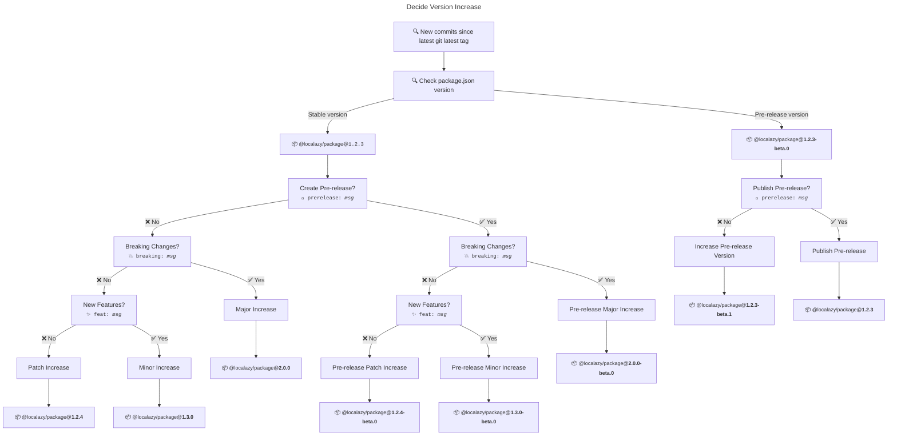
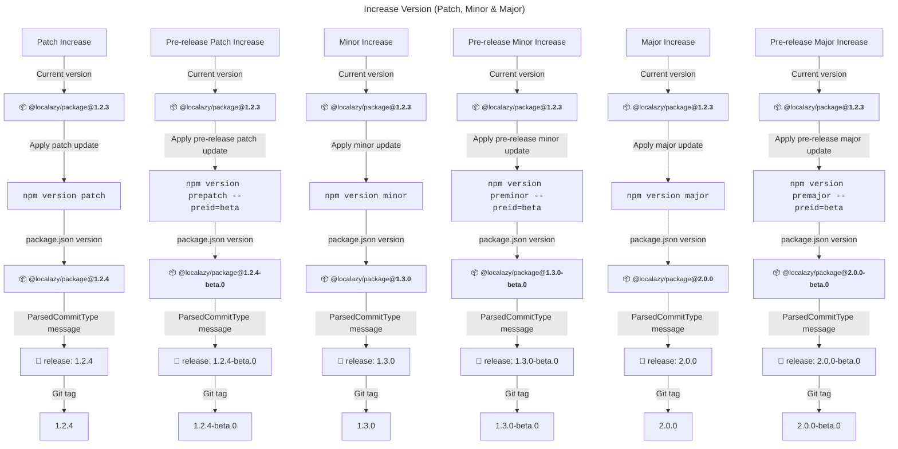
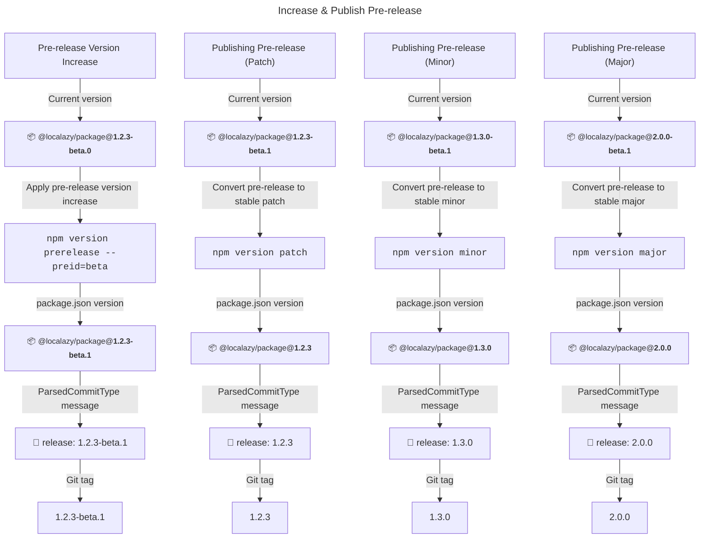

```mermaid
---
title: Decide Version Increase
---
graph TD
  PREV_TAG["🔍 New commits since latest git latest tag"] --> CHECK_VERSION["🔍 Check package.json version"]

  CHECK_VERSION -- "Stable version" --> STABLE_VERSION["<small>📦 @localazy/package@<code>1.2.3</code></small>"]
  CHECK_VERSION -- "Pre-release version" --> PRE_RELEASE["<small>📦 @localazy/package@<b>1.2.3-beta.0</b></small>"]

  STABLE_VERSION --> START_PRERELEASE["Create Pre-release?<br><small><code>🚧 prerelease: <i>msg</i></code></small>"]
  START_PRERELEASE -- "❌ No" --> CHECK_BREAKING["Breaking Changes?<br><small><code>💥 breaking: <i>msg</i></code></small>"]
  START_PRERELEASE -- "✅ Yes" --> CHECK_BREAKING_PRERELEASE["Breaking Changes?<br><small><code>💥 breaking: <i>msg</i></code></small>"]

  PRE_RELEASE --> PUBLISH_RELEASE["Publish Pre-release?<br><small><code>🚧 prerelease: <i>msg</i></code></small>"]
  PUBLISH_RELEASE -- "❌ No" --> PRERELEASE_INCREASE["Increase Pre-release Version"]
  PUBLISH_RELEASE -- "✅ Yes" --> DETERMINE_INCREASE_PRERELEASE["Publish Pre-release"]
  PRERELEASE_INCREASE --> PRERELEASE_VERSION["<small>📦 @localazy/package@<b>1.2.3-beta.1</b></small>"]

  CHECK_BREAKING -- " ❌ No " --> CHECK_FEATURES["New Features?<br><small><code>✨ feat: <i>msg</i></code></small>"]
  CHECK_BREAKING -- " ✅ Yes " --> MAJOR_INCREASE["Major Increase"]

  CHECK_BREAKING_PRERELEASE -- " ❌ No " --> CHECK_FEATURES_PRERELEASE["New Features?<br><small><code>✨ feat: <i>msg</i></code></small>"]
  CHECK_BREAKING_PRERELEASE -- " ✅ Yes " --> MAJOR_INCREASE_PRERELEASE["Pre-release Major Increase"]

  DETERMINE_INCREASE_PRERELEASE --> ORIGINAL_INCREASE_PRERELEASE["<small>📦 @localazy/package@<b>1.2.3</b></small>"]

  CHECK_FEATURES -- " ❌ No " --> PATCH_INCREASE["Patch Increase"]
  CHECK_FEATURES -- " ✅ Yes " --> MINOR_INCREASE["Minor Increase"]

  CHECK_FEATURES_PRERELEASE -- " ❌ No " --> PATCH_INCREASE_PRERELEASE["Pre-release Patch Increase"]
  CHECK_FEATURES_PRERELEASE -- " ✅ Yes " --> MINOR_INCREASE_PRERELEASE["Pre-release Minor Increase"]

  PATCH_INCREASE --> PATCH_VERSION["<small>📦 @localazy/package@<b>1.2.4</b></small>"]
  MINOR_INCREASE --> MINOR_VERSION["<small>📦 @localazy/package@<b>1.3.0</b></small>"]
  MAJOR_INCREASE --> MAJOR_VERSION["<small>📦 @localazy/package@<b>2.0.0</b></small>"]

  PATCH_INCREASE_PRERELEASE --> PATCH_VERSION_PRERELEASE["<small>📦 @localazy/package@<b>1.2.4-beta.0</b></small>"]
  MINOR_INCREASE_PRERELEASE --> MINOR_VERSION_PRERELEASE["<small>📦 @localazy/package@<b>1.3.0-beta.0</b></small>"]
  MAJOR_INCREASE_PRERELEASE --> MAJOR_VERSION_PRERELEASE["<small>📦 @localazy/package@<b>2.0.0-beta.0</b></small>"]
```

```mermaid
---
title: Increase Version (Patch, Minor & Major)
---
graph TD
  PATCH_START["Patch Increase"] -- "Current version" --> PATCH_INITIAL["<small>📦 @localazy/package@<b>1.2.3</b></small>"]
  PATCH_INITIAL -- "Apply patch update" --> PATCH_CMD["<code>npm version patch</code>"]
  PATCH_CMD -- "package.json version" --> PATCH_VERSION["<small>📦 @localazy/package@<b>1.2.4</b></small>"]
  PATCH_VERSION -- "ParsedCommitType message" --> PATCH_COMMIT["🚀 release: 1.2.4"]
  PATCH_COMMIT -- "Git tag" --> PATCH_TAG["1.2.4"]

  PATCH_PR_START["Pre-release Patch Increase"] -- "Current version" --> PATCH_PR_INITIAL["<small>📦 @localazy/package@<b>1.2.3</b></small>"]
  PATCH_PR_INITIAL -- "Apply pre-release patch update" --> PATCH_PR_CMD["<code>npm version prepatch --preid=beta</code>"]
  PATCH_PR_CMD -- "package.json version" --> PATCH_PR_VERSION["<small>📦 @localazy/package@<b>1.2.4-beta.0</b></small>"]
  PATCH_PR_VERSION -- "ParsedCommitType message" --> PATCH_PR_COMMIT["🚀 release: 1.2.4-beta.0"]
  PATCH_PR_COMMIT -- "Git tag" --> PATCH_PR_TAG["1.2.4-beta.0"]

  MINOR_START["Minor Increase"] -- "Current version" --> MINOR_INITIAL["<small>📦 @localazy/package@<b>1.2.3</b></small>"]
  MINOR_INITIAL -- "Apply minor update" --> MINOR_CMD["<code>npm version minor</code>"]
  MINOR_CMD -- "package.json version" --> MINOR_VERSION["<small>📦 @localazy/package@<b>1.3.0</b></small>"]
  MINOR_VERSION -- "ParsedCommitType message" --> MINOR_COMMIT["🚀 release: 1.3.0"]
  MINOR_COMMIT -- "Git tag" --> MINOR_TAG["1.3.0"]

  MINOR_PR_START["Pre-release Minor Increase"] -- "Current version" --> MINOR_PR_INITIAL["<small>📦 @localazy/package@<b>1.2.3</b></small>"]
  MINOR_PR_INITIAL -- "Apply pre-release minor update" --> MINOR_PR_CMD["<code>npm version preminor --preid=beta</code>"]
  MINOR_PR_CMD -- "package.json version" --> MINOR_PR_VERSION["<small>📦 @localazy/package@<b>1.3.0-beta.0</b></small>"]
  MINOR_PR_VERSION -- "ParsedCommitType message" --> MINOR_PR_COMMIT["🚀 release: 1.3.0-beta.0"]
  MINOR_PR_COMMIT -- "Git tag" --> MINOR_PR_TAG["1.3.0-beta.0"]

  MAJOR_START["Major Increase"] -- "Current version" --> MAJOR_INITIAL["<small>📦 @localazy/package@<b>1.2.3</b></small>"]
  MAJOR_INITIAL -- "Apply major update" --> MAJOR_CMD["<code>npm version major</code>"]
  MAJOR_CMD -- "package.json version" --> MAJOR_VERSION["<small>📦 @localazy/package@<b>2.0.0</b></small>"]
  MAJOR_VERSION -- "ParsedCommitType message" --> MAJOR_COMMIT["🚀 release: 2.0.0"]
  MAJOR_COMMIT -- "Git tag" --> MAJOR_TAG["2.0.0"]

  MAJOR_PR_START["Pre-release Major Increase"] -- "Current version" --> MAJOR_PR_INITIAL["<small>📦 @localazy/package@<b>1.2.3</b></small>"]
  MAJOR_PR_INITIAL -- "Apply pre-release major update" --> MAJOR_PR_CMD["<code>npm version premajor --preid=beta</code>"]
  MAJOR_PR_CMD -- "package.json version" --> MAJOR_PR_VERSION["<small>📦 @localazy/package@<b>2.0.0-beta.0</b></small>"]
  MAJOR_PR_VERSION -- "ParsedCommitType message" --> MAJOR_PR_COMMIT["🚀 release: 2.0.0-beta.0"]
  MAJOR_PR_COMMIT -- "Git tag" --> MAJOR_PR_TAG["2.0.0-beta.0"]
```

```mermaid
---
title: Increase & Publish Pre-release
---
graph TD
  PRERELEASE_START["Pre-release Version Increase"] -- "Current version" --> PRERELEASE_INITIAL["<small>📦 @localazy/package@<b>1.2.3-beta.0</b></small>"]
  PRERELEASE_INITIAL -- "Apply pre-release version increase" --> PRERELEASE_CMD["<code>npm version prerelease --preid=beta</code>"]
  PRERELEASE_CMD -- "package.json version" --> PRERELEASE_VERSION["<small>📦 @localazy/package@<b>1.2.3-beta.1</b></small>"]
  PRERELEASE_VERSION -- "ParsedCommitType message" --> PRERELEASE_COMMIT["🚀 release: 1.2.3-beta.1"]
  PRERELEASE_COMMIT -- "Git tag" --> PRERELEASE_TAG["1.2.3-beta.1"]

  PUBLISH_PATCH_START["Publishing Pre-release (Patch)"] -- "Current version" --> PUBLISH_PATCH_INITIAL["<small>📦 @localazy/package@<b>1.2.3-beta.1</b></small>"]
  PUBLISH_PATCH_INITIAL -- "Convert pre-release to stable patch" --> PUBLISH_PATCH_CMD["<code>npm version patch</code>"]
  PUBLISH_PATCH_CMD -- "package.json version" --> PUBLISH_PATCH_VERSION["<small>📦 @localazy/package@<b>1.2.3</b></small>"]
  PUBLISH_PATCH_VERSION -- "ParsedCommitType message" --> PUBLISH_PATCH_COMMIT["🚀 release: 1.2.3"]
  PUBLISH_PATCH_COMMIT -- "Git tag" --> PUBLISH_PATCH_TAG["1.2.3"]

  PUBLISH_MINOR_START["Publishing Pre-release (Minor)"] -- "Current version" --> PUBLISH_MINOR_INITIAL["<small>📦 @localazy/package@<b>1.3.0-beta.1</b></small>"]
  PUBLISH_MINOR_INITIAL -- "Convert pre-release to stable minor" --> PUBLISH_MINOR_CMD["<code>npm version minor</code>"]
  PUBLISH_MINOR_CMD -- "package.json version" --> PUBLISH_MINOR_VERSION["<small>📦 @localazy/package@<b>1.3.0</b></small>"]
  PUBLISH_MINOR_VERSION -- "ParsedCommitType message" --> PUBLISH_MINOR_COMMIT["🚀 release: 1.3.0"]
  PUBLISH_MINOR_COMMIT -- "Git tag" --> PUBLISH_MINOR_TAG["1.3.0"]

  PUBLISH_MAJOR_START["Publishing Pre-release (Major)"] -- "Current version" --> PUBLISH_MAJOR_INITIAL["<small>📦 @localazy/package@<b>2.0.0-beta.1</b></small>"]
  PUBLISH_MAJOR_INITIAL -- "Convert pre-release to stable major" --> PUBLISH_MAJOR_CMD["<code>npm version major</code>"]
  PUBLISH_MAJOR_CMD -- "package.json version" --> PUBLISH_MAJOR_VERSION["<small>📦 @localazy/package@<b>2.0.0</b></small>"]
  PUBLISH_MAJOR_VERSION -- "ParsedCommitType message" --> PUBLISH_MAJOR_COMMIT["🚀 release: 2.0.0"]
  PUBLISH_MAJOR_COMMIT -- "Git tag" --> PUBLISH_MAJOR_TAG["2.0.0"]
```
